# StyleIt Project


StyleIt Project adalah aplikasi web berbasis Laravel yang dikembangkan untuk mendukung proses booking layanan pada Lisa Yuli Belti Wedding Gallery dan Makeup Artist. Aplikasi ini membantu customer melihat informasi layanan, memilih paket, melakukan booking, dan melihat invoice. Selain itu, aplikasi ini juga membantu pihak usaha dalam mengelola data layanan, portofolio, booking, pembayaran, dan dokumentasi transaksi.

---

## Daftar Isi

- [Deskripsi Proyek](#deskripsi-proyek)
- [Tujuan Aplikasi](#tujuan-aplikasi)
- [Target Pengguna](#target-pengguna)
- [Fitur Utama](#fitur-utama)
- [Tech Stack](#tech-stack)
- [Dependency](#dependency)
- [Struktur Folder Penting](#struktur-folder-penting)
- [Screenshot](#screenshot)
- [Instalasi](#instalasi)
- [Tim Pengembang](#tim-pengembang)

---

## Deskripsi Proyek

Proyek ini dibuat sebagai bagian dari Project-Based Learning pada mata kuliah Konstruksi dan Evolusi Perangkat Lunak. Sistem ini dikembangkan untuk menyelesaikan permasalahan pengelolaan layanan yang sebelumnya masih dilakukan secara manual atau belum terdokumentasi secara terpusat.

Dengan adanya aplikasi StyleIt Project, proses pemesanan layanan dapat dilakukan lebih terstruktur. Customer dapat melihat informasi usaha dan layanan secara online, sedangkan admin atau owner dapat mengelola data yang berkaitan dengan layanan, booking, pembayaran, invoice, portofolio, serta informasi usaha.

---

## Tujuan Aplikasi

- Mempermudah customer dalam melihat informasi layanan dan paket yang tersedia.
- Mempermudah customer dalam melakukan booking layanan.
- Membantu pihak usaha mengelola data booking secara lebih terstruktur.
- Membantu pengelolaan invoice atau bukti booking.
- Mendukung dokumentasi portofolio dan informasi usaha secara online.

---

## Target Pengguna

| Role | Deskripsi |
|------|-----------|
| Customer | Melihat layanan, memilih paket, melakukan booking, dan mengunduh invoice |
| Admin | Membantu mengelola data operasional dan memantau booking |
| Owner | Mengelola data utama usaha, portofolio, laporan, dan aktivitas pemesanan |

---

## Fitur Utama

| No | Fitur | Deskripsi |
|----|-------|-----------|
| 1 | Login & Register | Autentikasi user dengan role customer, admin, dan owner |
| 2 | Home | Halaman utama berisi informasi usaha dan navigasi layanan |
| 3 | Profil Usaha | Informasi usaha, kontak WhatsApp, dan akun Instagram |
| 4 | Portofolio | Galeri hasil layanan dengan filter kategori |
| 5 | Pricelist | Daftar paket layanan beserta harga dan DP |
| 6 | Keranjang | Penyimpanan sementara paket yang dipilih sebelum checkout |
| 7 | Checkout | Proses booking dengan upload bukti pembayaran DP |
| 8 | Booking Customer | Riwayat dan detail booking dengan kode unik LYB-PREV-xxxxx |
| 9 | Dashboard Customer | Ringkasan aktivitas customer setelah login |
| 10 | Invoice | Tampilan invoice dan cetak langsung via web (CSS print-friendly) |

---

## Tech Stack

| Teknologi | Keterangan |
|-----------|------------|
| Laravel | Framework PHP utama |
| PHP 8.3+ | Bahasa pemrograman backend |
| Blade Template | Template engine Laravel untuk tampilan |
| CSS | Styling tampilan frontend |
| MySQL 8.0 | Database utama |
| Composer | Dependency manager PHP |
| Node.js & NPM | Kompilasi aset frontend |
| Git & GitHub | Version control dan kolaborasi tim |

---

## Dependency

### Dependency yang Sudah Diimplementasikan

| Package | Versi | Fungsi |
|---------|-------|--------|
| spatie/laravel-permission | ^8.0 | Pengelolaan role dan permission (customer, admin, owner) |
| midtrans/midtrans-php | ^2.6 | Integrasi payment gateway untuk pembayaran DP online via Snap |
| mews/captcha | ^3.5 | Pembuatan dan validasi captcha pada form login |
| intervention/image | ^4.1 | Resize, crop, dan kompres gambar upload (paket layanan) |
| Laravel Authentication | Bawaan | Login, logout, session, dan pengecekan user aktif |
| Laravel Validation | Bawaan | Validasi input form |
| Laravel File Storage | Bawaan | Upload dan penyimpanan file gambar |
| CSS Web Print (Native) | Bawaan | Cetak/simpan invoice langsung via fitur cetak browser |

### Dependency Rencana Pengembangan

| Package | Fungsi |
|---------|--------|
| maatwebsite/excel | Export laporan keuangan dan rekap transaksi ke Excel |
| Laravel Mail / Notification | Notifikasi booking dan invoice via email |

Dokumentasi lengkap dependency tersedia di [docs/dependency.md](docs/dependency.md).

---

## Struktur Folder Penting

```text
styleit.project/
├── .github/
│   └── workflows/
│       ├── code-linting.yml          # CI: pemeriksaan sintaks PHP, HTML, CSS
│       └── test-before-merge.yml     # CI: automated testing sebelum merge
├── app/
│   ├── Http/
│   │   └── Controllers/
│   │       ├── customer/             # Controller khusus role customer
│   │       ├── AuthController.php
│   │       ├── Controller.php
│   │       └── PublicPageController.php
│   ├── Models/                       # Eloquent models
│   │   ├── Addon.php
│   │   ├── BlockedDate.php
│   │   ├── Booking.php
│   │   ├── Payment.php
│   │   ├── PortfolioItem.php
│   │   ├── ServiceCategory.php
│   │   ├── ServicePackage.php
│   │   └── User.php
│   └── Support/                      # Class pendukung
├── config/                           # Konfigurasi Laravel
├── database/
│   ├── migrations/                   # File migrasi tabel database
│   └── seeders/                      # Seeder data awal (RoleSeeder, dll.)
├── docs/                             # Dokumentasi project
│   ├── dependency.md
│   ├── dokumentasi-dependency-laravel.md
│   ├── features.md
│   ├── github-actions.md
│   ├── installation.md
│   └── refactoring.md
├── public/
│   ├── css/                          # File CSS publik
│   └── images/                       # Aset gambar publik
├── resources/
│   └── views/
│       ├── auth/                     # Halaman login, register, dll.
│       ├── components/               # Komponen Blade reusable
│       ├── customer/                 # Halaman dashboard, booking, keranjang
│       ├── layanan/                  # Halaman layanan publik
│       ├── layouts/                  # Layout utama aplikasi
│       ├── paket/                    # Halaman detail paket
│       ├── home.blade.php
│       ├── portofolio.blade.php
│       ├── pricelist.blade.php
│       └── profil.blade.php
├── routes/
│   └── web.php                       # Definisi route aplikasi
├── tests/                            # Test suite Laravel
├── CHANGELOG.md
├── README.md
├── composer.json
└── .env.example
```

---

## Screenshot

Berikut adalah beberapa tampilan antarmuka (UI) dari StyleIt Project:

### 1. Halaman Publik & Autentikasi
| Halaman | Preview |
|---------|---------|
| **Home** | 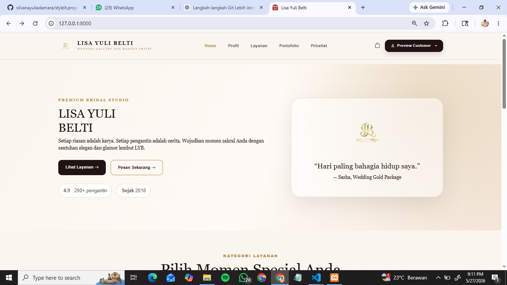 |
| **Login** | 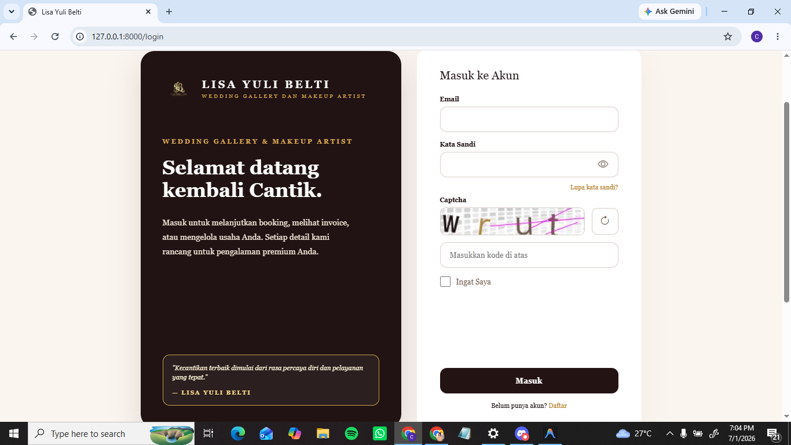 |
| **Register** | 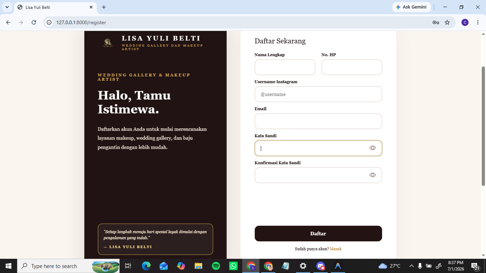 |
| **Profil Usaha** | 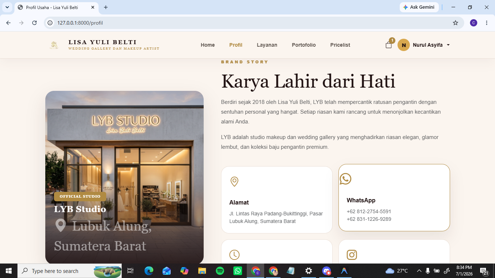 |
| **Portofolio** | 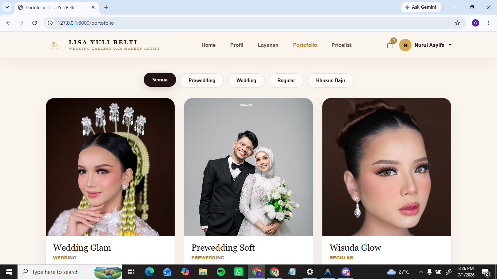 |
| **Pricelist** | 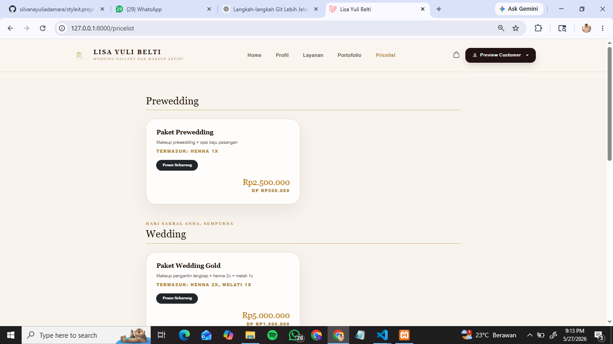 |

### 2. Fitur & Halaman Customer
| Halaman | Preview |
|---------|---------|
| **Ubah Profil** | 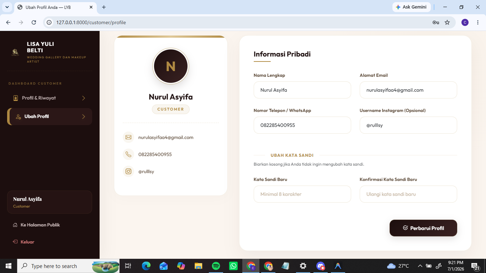 |
| **Keranjang** | 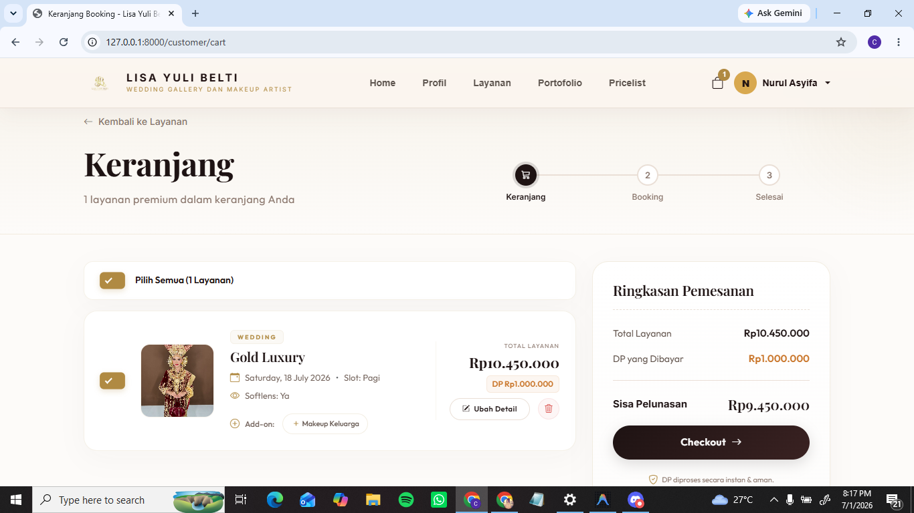 |
| **Checkout (Midtrans)** | 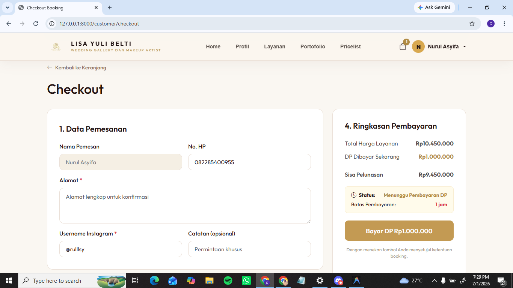 |
| **DP Berhasil** | 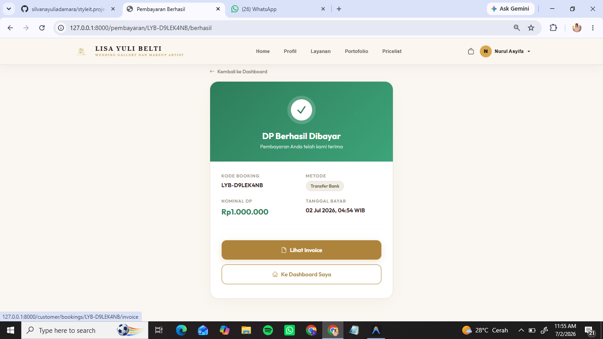 |
| **Dashboard Customer** | 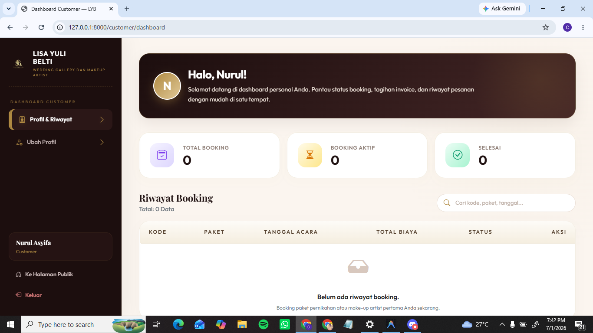 |
| **Invoice** | 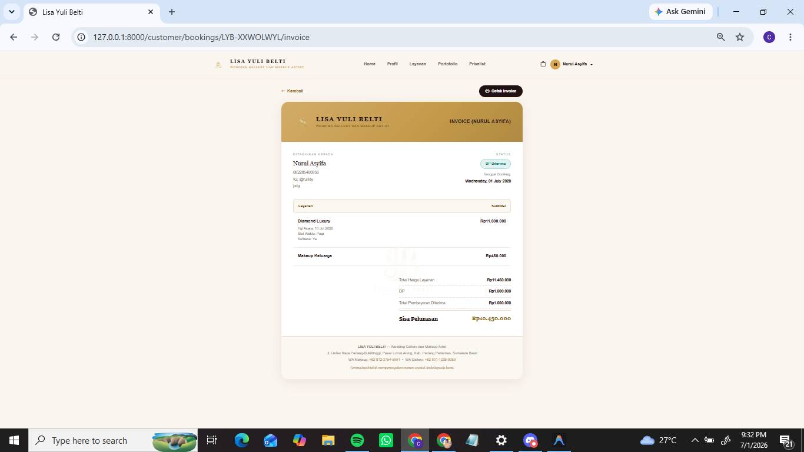 |

### 3. Detail Paket Layanan
| Paket | Preview |
|---------|---------|
| **Paket Prewedding** | 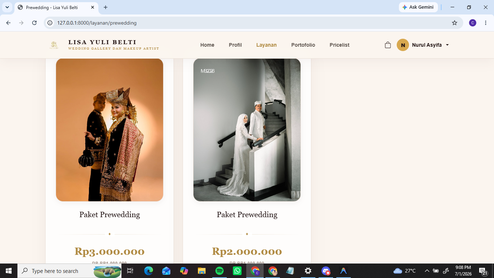 |
| **Paket Wedding** | 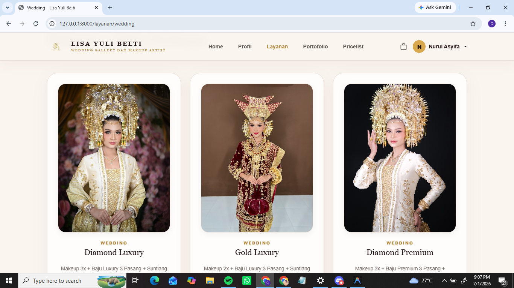 |
| **Paket Regular** | 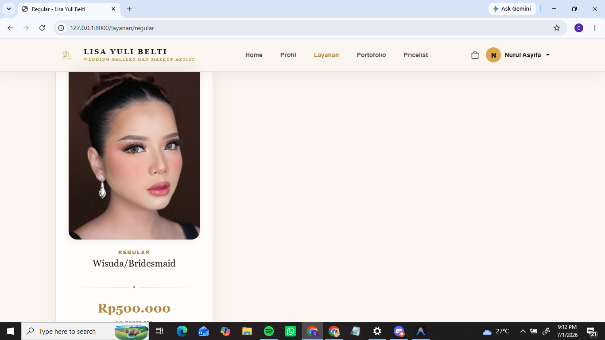 |
| **Paket Khusus Baju** | 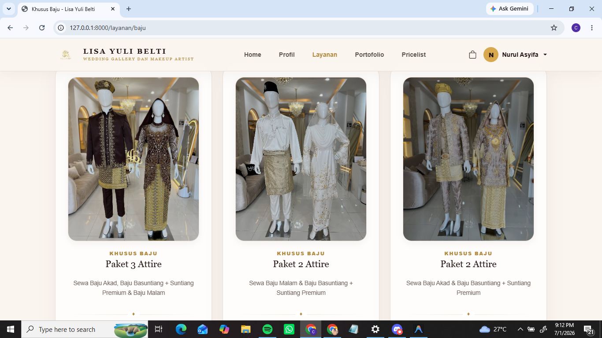 |

### 4. Halaman Dashboard Pengelola (Admin & Owner)
| Halaman | Preview |
|---------|---------|
| **Dashboard Admin** | 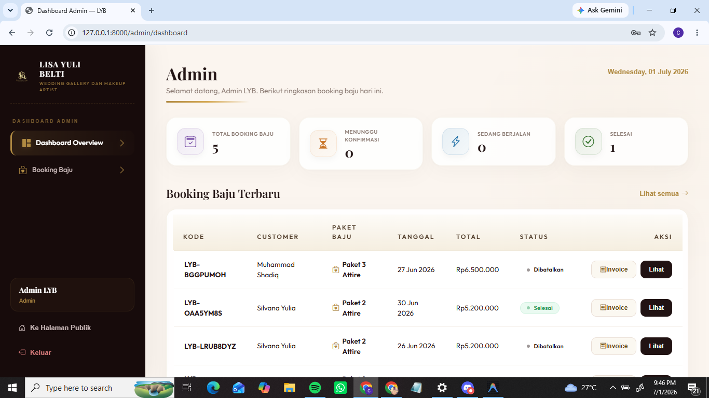 |
| **Dashboard Owner** | 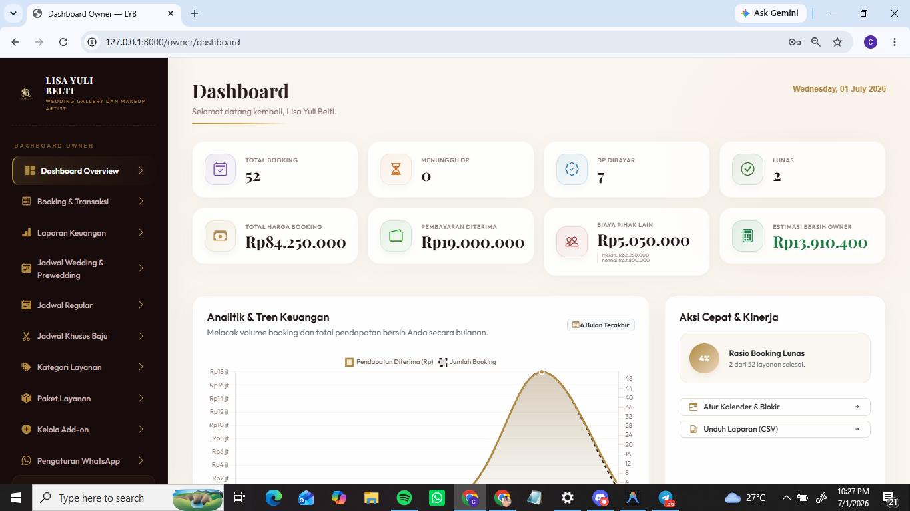 |


---

## Instalasi

Panduan instalasi lengkap tersedia di [docs/installation.md](docs/installation.md).

Langkah singkat:

```bash
# 1. Clone repository
git clone https://github.com/silvanayuliadamara/styleit.project.git
cd styleit.project

# 2. Install dependency PHP
composer install

# 3. Install dependency frontend
npm install

# 4. Konfigurasi environment
cp .env.example .env
php artisan key:generate

# 5. Konfigurasi database di .env, lalu jalankan migrasi
php artisan migrate --seed

# 6. Buat symbolic link storage
php artisan storage:link

# 7. Jalankan server
npm run dev
php artisan serve
```

Akses aplikasi di: `http://localhost:8000`

---

## Tim Pengembang

Proyek ini dikembangkan oleh mahasiswa dalam rangka Project-Based Learning pada mata kuliah Konstruksi dan Evolusi Perangkat Lunak.

| Nama | NIM | Role |
|------|-----|------|
| Silvana Yulia Damara | 2411081023 | Project Manager |
| Salwa Aprilia | 2411082029 | System Analyst |
| Nurul Asyifa | 2411082018 | Lead Programmer |
| Muhammad Abdul Hafiz | 2311082025 | Quality Assurance |

---

## Dokumentasi

| Dokumen | Deskripsi |
|---------|-----------|
| [docs/installation.md](docs/installation.md) | Panduan instalasi lengkap |
| [docs/features.md](docs/features.md) | Dokumentasi fitur aplikasi |
| [docs/dependency.md](docs/dependency.md) | Dokumentasi dependency project |
| [docs/refactoring.md](docs/refactoring.md) | Dokumentasi keputusan refactoring |
| [docs/github-actions.md](docs/github-actions.md) | Dokumentasi konfigurasi CI/CD |
| [docs/kontribusi.md](docs/kontribusi.md) | Dokumentasi kontribusi pengembang |
| [CHANGELOG.md](CHANGELOG.md) | Riwayat perubahan project |
