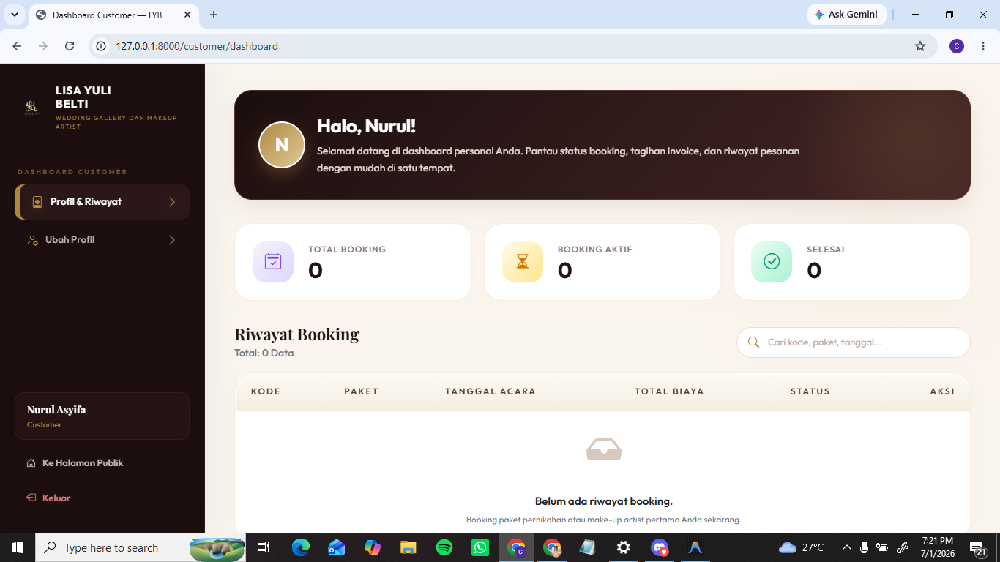

# Feature Documentation

Dokumen ini menjelaskan fitur-fitur utama pada project StyleIt / Lisa Yuli Belti Wedding Gallery dan Makeup Artist.

---

## 1. Login

### Tujuan Fitur
Fitur login digunakan agar user dapat masuk ke sistem menggunakan akun yang sudah terdaftar.

### Aktor
- Customer
- Admin
- Owner

### Alur Fitur
User membuka halaman login, lalu memasukkan email dan kata sandi. Sistem akan memvalidasi data login. Jika data benar, user diarahkan ke halaman dashboard sesuai role masing-masing. Jika data salah, sistem menampilkan pesan error.

### Route / Controller Terkait
- Route: `GET /login`
- Route: `POST /login`
- Controller: `AuthController`

### Screenshot Fitur

---

## 2. Register

### Tujuan Fitur
Fitur register digunakan agar customer dapat membuat akun baru sebelum melakukan booking layanan.

### Aktor
- Customer

### Alur Fitur
Customer membuka halaman register, lalu mengisi data akun yang terdiri dari enam field: Nama Lengkap, No. HP, Username Instagram, Email, Kata Sandi, dan Konfirmasi Kata Sandi. Sistem melakukan validasi data. Jika data valid, akun customer disimpan ke database dan customer dapat login ke sistem.

### Route / Controller Terkait
- Route: `GET /register`
- Route: `POST /register`
- Controller: `AuthController`

### Screenshot Fitur

---

## 3. Home

### Tujuan Fitur
Fitur home digunakan sebagai halaman utama yang menampilkan informasi awal mengenai Lisa Yuli Belti Wedding Gallery dan Makeup Artist.

### Aktor
- Pengunjung
- Customer

### Alur Fitur
User membuka halaman utama website. Sistem menampilkan informasi usaha, banner utama, navigasi menu, ringkasan layanan, portofolio singkat, keunggulan usaha, dan tombol menuju halaman lain seperti layanan atau pricelist.

### Route / Controller Terkait
- Route: `GET /`
- Controller: `PublicPageController`

### Screenshot Fitur

---

## 4. Profil Usaha

### Tujuan Fitur
Fitur profil usaha digunakan untuk menampilkan informasi mengenai usaha Lisa Yuli Belti Wedding Gallery dan Makeup Artist.

### Aktor
- Pengunjung
- Customer

### Alur Fitur
User membuka halaman profil usaha. Sistem menampilkan informasi tentang usaha, deskripsi layanan, alamat, kontak WhatsApp, jam operasional, dan akun Instagram yang dapat dihubungi oleh customer.

### Route / Controller Terkait
- Route: `GET /profil`
- Controller: `PublicPageController`

### Screenshot Fitur

---

## 5. Portofolio

### Tujuan Fitur
Fitur portofolio digunakan untuk menampilkan dokumentasi hasil layanan Lisa Yuli Belti Wedding Gallery dan Makeup Artist.

### Aktor
- Pengunjung
- Customer

### Alur Fitur
User membuka halaman portofolio. Sistem menampilkan galeri foto hasil layanan beserta filter kategori, yaitu Semua, Prewedding, Wedding, Regular, dan Khusus Baju. User dapat memilih kategori untuk menyaring tampilan galeri sesuai jenis layanan. Setiap item portofolio menampilkan foto, nama, kategori, dan deskripsi singkat hasil layanan. User dapat melihat contoh hasil layanan sebelum melakukan booking.

### Route / Controller Terkait
- Route: `GET /portofolio`
- Controller: `PublicPageController`

### Screenshot Fitur

---

## 6. Pricelist

### Tujuan Fitur
Fitur pricelist digunakan untuk menampilkan daftar harga atau paket layanan yang tersedia.

### Aktor
- Pengunjung
- Customer

### Alur Fitur
User membuka halaman pricelist. Sistem menampilkan daftar paket layanan yang dikelompokkan berdasarkan kategori, seperti Prewedding dan Wedding. Setiap paket menampilkan nama paket, deskripsi, item yang termasuk, harga, DP, dan tombol Pesan Sekarang. Customer dapat melihat informasi harga sebelum memilih layanan yang ingin dipesan.

### Route / Controller Terkait
- Route: `GET /pricelist`
- Controller: `PublicPageController`

### Screenshot Fitur

---

## 7. Keranjang

### Tujuan Fitur
Fitur keranjang digunakan untuk menyimpan sementara paket layanan yang dipilih customer sebelum melakukan checkout.

### Aktor
- Customer

### Alur Fitur
Customer memilih paket layanan yang ingin dipesan. Sistem memasukkan paket tersebut ke dalam keranjang. Customer dapat membuka halaman keranjang untuk melihat daftar paket yang dipilih, mengecek detail pesanan seperti tanggal, softlens, dan add-on yang dipilih, serta ringkasan total harga dan DP. Customer dapat menghapus paket atau melanjutkan ke halaman checkout.

### Route / Controller Terkait
- Route: `GET /customer/cart`
- Route: `DELETE /customer/cart/{key}`
- Controller: `CartController`

### Screenshot Fitur

---

## 8. Checkout

### Tujuan Fitur
Fitur checkout digunakan untuk memproses paket layanan yang telah dipilih customer menjadi data booking.

### Aktor
- Customer

### Alur Fitur
Customer membuka halaman checkout setelah memilih paket layanan. Sistem menampilkan detail pesanan, tanggal booking, total harga, DP, dan sisa pembayaran. Customer mengisi field Catatan untuk Admin (opsional, berisi request look, alamat acara, jam acara, dll.) dan mengupload bukti pembayaran DP dalam format jpg/png/webp maksimal 2 MB. Setelah data diisi, customer menekan tombol Buat Booking dan sistem menyimpan data booking ke database.

### Route / Controller Terkait
- Route: `GET /customer/checkout`
- Route: `POST /customer/checkout`
- Controller: `CheckoutController`

### Screenshot Fitur

---

## 9. Booking Customer

### Tujuan Fitur
Fitur booking customer digunakan untuk menampilkan daftar booking yang telah dibuat oleh customer.

### Aktor
- Customer

### Alur Fitur
Customer membuka halaman booking. Sistem menampilkan daftar booking yang dimiliki customer dalam bentuk tabel yang berisi kolom Kode (kode unik booking seperti LYB-PREV-xxxxx), Paket, Tanggal, Total, Status booking (contoh: Pending, Menunggu Konfirmasi), dan Status Pembayaran (contoh: Belum Bayar, Dp Diupload). Customer dapat menekan tombol Detail untuk melihat informasi lengkap booking yang sudah dibuat.

### Route / Controller Terkait
- Route: `GET /customer/bookings`
- Route: `GET /customer/bookings/{booking}`
- Controller: `CustomerBookingController`

### Screenshot Fitur

---

## 10. Dashboard Customer

### Tujuan Fitur
Dashboard customer digunakan untuk menampilkan ringkasan aktivitas customer setelah login.

### Aktor
- Customer

### Alur Fitur
Customer berhasil login ke sistem, lalu diarahkan ke dashboard customer. Sistem menampilkan informasi ringkasan seperti data akun customer, jumlah booking, status booking terbaru, dan akses cepat menuju halaman booking atau layanan.

### Route / Controller Terkait
- Route: `GET /customer/dashboard`
- Controller: `CustomerDashboardController`

### Screenshot Fitur

